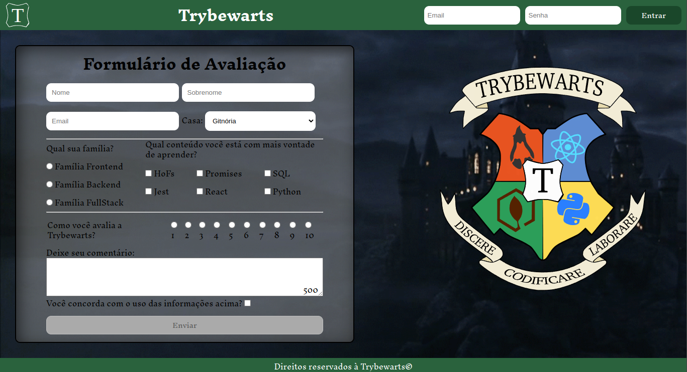

# README: Trybewarts



## Project Description

This project is one of my favorites from my learning the basics phase. I collaborated with my colleague, Amanda Diniz, and we put in a lot of effort to style it. It's a form where you can submit information (to the void) and it's themed around the world of Harry Potter.

### Technologies

- LINUX
- VSCODE
- HTML
- CSS
- JAVASCRIPT

### What I Learned

- How to add fonts and wallpapers to the application
- How to show and hide sessions on a button click

## How to Run the Project

1. Clone the repository:

   ```bash
   git clone https://github.com/feduarte-dev/trybewarts
   ```

2. Navigate to the project directory:

   ```bash
   cd your-repository
   ```

3. Install dependencies:

   ```bash
   npm install
   ```

4. Run application:

   ```bash
   Right click index.html and open it with live server
   ```

## Contributions

[Felipe](https://www.linkedin.com/in/feduarte-dev/) and [Amanda](https://www.linkedin.com/in/amanda-diniz-pod/)- index.html - style.css - script.js


[Trybe](https://www.betrybe.com/) - Everything else
